<p align="center">
  
</p>

<p align="center">
  <a href="#quick-start"></a>
  
  
  
</p>

# CEREBRO

*Every file is a neuron. The wiki is the connectome.*

Cerebro is an agent skill that **scans your entire repository and writes a
wiki-OS**: numbered, LLM-first markdown pages in the style of Karpathy's
"docs for LLMs" idea — dense, explicit, self-contained, navigable from a
single index. From that moment on, the wiki is the **single source of
truth**: every development task starts by reading it and ends by updating
it, and any divergence between wiki and code is surfaced as **drift**
instead of being silently papered over.

It is a **protocol, not a product**. Plain markdown plus ordinary file
reads/writes — so it runs identically on Claude Code, Cursor, Windsurf,
Aider, a raw API loop against any vendor, or a local model on Ollama.
No vendor tools, no API keys, no dependencies.

## Why

Every AI coding session starts the same way: the model re-discovers your
codebase from scratch, guesses your conventions, and forgets everything at
the end. Cerebro replaces that amnesia with a persistent, versioned memory
that lives *in the repo*, travels with `git clone`, and is written in the
one format every model reads natively: markdown.

```
/cerebro scan     →  the model reads every neuron in the repo, writes the map
/cerebro sync     →  mutations since last sync flow into the affected pages
/cerebro recall   →  development guided by the wiki as binding truth
/cerebro audit    →  drift hunt: wiki claims verified against actual code
```

## The Three Laws

1. **The wiki is the source of truth.** Code tells you what *is*; the wiki
   tells you what *should be*.
2. **No task ends without a sync.** Wiki updates ship in the same commit as
   the code they describe.
3. **Drift is declared, never silently fixed.** When wiki and code disagree,
   the human picks the truth.

## What the wiki-OS looks like

```
wiki/
├── 00-INDEX.md          the map of the map — read this first, always
├── 01-VISION.md         what the project is, for whom, what it is NOT
├── 02-ARCHITECTURE.md   components, boundaries, data flow
├── 03-STACK.md          languages, versions, why each
├── 04-CONVENTIONS.md    naming, patterns, the DO-NOT list
├── 05-STRUCTURE.md      directory → responsibility map
├── ...
├── 10-DECISIONS.md      append-only ADR log
└── 12-CHANGELOG.md      one line per sync
```

Pages are created only when the repo feeds them (`"pages": "auto"`), page
numbers are stable API, every claim cites a real file path, and each page
ends with explicit `Invariants` and `DO NOT` sections. Full model in
[`references/wiki-model.md`](references/wiki-model.md).

## Install

Cerebro is a Claude Code skill: it lives in a `skills` directory, and the
agent loads it at session start. Pick one of the methods below.

### One-liner (recommended)

Runs the bundled Python installer straight from the repo — no clone needed.
It auto-detects your platform, drops the skill into the right place, sets the
helper scripts executable, and never double-nests the folder:

```bash
curl -sSL https://raw.githubusercontent.com/itboy79/cerebro/main/install.py | python3 -
```

Installs to your **personal** skills dir (`~/.claude/skills/cerebro`), so
it's available in every project. Add flags after `python3 -` like so:

```bash
# install for the current repo only (./.claude/skills/cerebro)
curl -sSL https://raw.githubusercontent.com/itboy79/cerebro/main/install.py | python3 - --project

# install into a custom skills directory
curl -sSL https://raw.githubusercontent.com/itboy79/cerebro/main/install.py | python3 - --dir ~/my-skills

# target another SKILL.md agent (openclaw, cursor, codex, gemini)
curl -sSL https://raw.githubusercontent.com/itboy79/cerebro/main/install.py | python3 - --agent openclaw
```

### Clone, then install

```bash
git clone https://github.com/itboy79/cerebro.git
cd cerebro
python3 install.py            # personal · use --project or --dir PATH to change scope
```

Run from inside the checkout and the installer copies from local files
instead of downloading. Re-running upgrades in place.

### Manual (no Python)

The skill is just a folder — copy the four skill parts in yourself:

```bash
git clone https://github.com/itboy79/cerebro.git
mkdir -p ~/.claude/skills/cerebro
cp -r cerebro/{SKILL.md,assets,references,scripts} ~/.claude/skills/cerebro/
```

> **Gotcha:** `SKILL.md` must sit *directly* inside
> `~/.claude/skills/cerebro/` — not one level deeper. GitHub zips often add
> an extra nesting folder; if `/cerebro` doesn't load, that's usually why.

### Verify & run

Skills load at session start, so **restart Claude Code** after installing,
then in any repo:

```
/cerebro
```

First run scans and generates `wiki/`; every later run syncs it. Confirm the
install with `ls ~/.claude/skills/cerebro` (you should see `SKILL.md`,
`assets`, `references`, `scripts`) or by asking Claude Code which skills it
has available.

> Skills need Claude Code (`claude --version` to check) or any agent that
> reads the [`SKILL.md`](https://agentskills.io) format. Install Claude Code
> from https://claude.ai/install.

### Other harnesses

**Cursor / Windsurf / Aider / raw API / Ollama** — add `SKILL.md` to your
project rules or paste it on demand, then say "run /cerebro scan".
Per-harness notes and the huge-repo delegation pattern live in
[`references/providers.md`](references/providers.md).

## Configuration

Config lives in `.cerebro/config.json` (created on first run from
[`assets/config.example.json`](assets/config.example.json)):

```json
{
  "wiki_dir": "wiki",
  "language": "en",
  "pages": "auto",
  "ignore": ["node_modules", ".git", "dist", "build", "target"],
  "max_file_kb": 256,
  "laws": { "source_of_truth": true, "sync_every_task": true, "declare_drift": true }
}
```

Sync state (last commit anchor, page map) is sealed in
`.cerebro/state.json` — written by Cerebro, never by hand.

## Model-agnostic by design

| Runs on | How |
|---------|-----|
| Claude Code | native skill, `/cerebro` |
| Cursor / Windsurf | project rules |
| Aider | `/read SKILL.md` |
| Any API (Anthropic, OpenAI-compatible, Gemini, Mistral…) | thin loop + file tools |
| Ollama / local models | same loop against `localhost:11434` |

The two bundled Python helpers (`cerebro_scan.py` for a deterministic repo
map, `cerebro_intro.py` for the first-spark animation) are stdlib-only
conveniences — the protocol degrades gracefully without Python, git, or
even a shell.

On huge repos, the strongest model can delegate per-module scan chunks to
cheaper or local models and review their drafts before writing a single
page. If [Brigade](https://github.com/itboy79/brigade) is installed in the
repo, Cerebro borrows its cooks as default delegates — but never requires it.

## Anatomy

```
cerebro/
├── SKILL.md                     the protocol
├── install.py                   stdlib installer (one-liner or clone-and-run)
├── assets/
│   ├── banner.svg
│   └── config.example.json
├── references/
│   ├── wiki-model.md            the Karpathy-style page catalogue + writing rules
│   └── providers.md             harness notes + delegation pattern
└── scripts/
    ├── cerebro_scan.py          deterministic repo map (stdlib only)
    └── cerebro_intro.py         first-spark ANSI animation (skippable, unbreakable)
```

## FAQ

**Is this just "generate docs"?** No. Docs describe; a wiki-OS *governs*.
The Three Laws make it the binding contract every subsequent AI session
develops against — and drift detection keeps the contract honest.

**Will it bloat my repo?** A wiki-OS for a mid-size project is typically
10–15 small markdown files. Hollow pages are forbidden by protocol.

**Does it need my API keys?** Never. Cerebro runs inside whatever agent you
already use, with whatever model you already pay for — cloud or local.

**Why "Cerebro"?** Because that's what it is — a brain for the repo:
every file a neuron, every sync an impulse, the wiki its connectome.

---

<p align="center">
  Built by <a href="https://mirailab.it">MiraiLab</a> · sibling of <a href="https://github.com/itboy79/brigade">Brigade</a> · MIT
</p>
